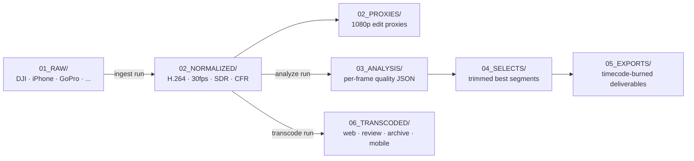

# Skyforge

**Turns raw footage from drones, phones, and action cams into an organized, analyzed, export-ready media library — from one terminal, no video editor required.**

[](https://www.python.org/downloads/)
[](https://ffmpeg.org/)
[](https://opencv.org/)
[](#honest-status)

The whole core workflow is three commands:

```console
$ skyforge init new "2nd Flight"

Project created: 2nd Flight

Structure:
  2nd Flight/
  ├── 01_RAW/
  │   └── Drone/
  │   └── iPhone/
  │   └── Meta_Glasses/
  ├── 02_NORMALIZED/
  ├── 02_PROXIES/
  ├── 03_PROJECT/
  ├── 04_EXPORTS/
  └── project.json

Drop your raw footage into 01_RAW/<device>/ then run:
  skyforge ingest run 2nd Flight

$ skyforge ingest run "2nd Flight"
FlightDeck not configured. Running locally.
Configure with: skyforge auth login

Skyforge Ingest Pipeline (local)
  Project:    2nd Flight
  Target FPS: 30
  CRF:        18
  Proxies:    yes

⠹ Drone DJI_0042.MP4 ━━━━━━━━━━━━━━━━━━━━━━━━ 100% 0:06:31

Processed: 7 files
HDR -> SDR tonemapped: 3 files

Manifest: 2nd Flight/manifest.json

Normalized: 2nd Flight/02_NORMALIZED
Proxies:    2nd Flight/02_PROXIES

$ skyforge analyze run "2nd Flight"
FlightDeck not configured. Running locally.
Configure with: skyforge auth login

Skyforge Video Analysis Pipeline (local)
  Project:        2nd Flight
  Videos:         7
  Segment range:  5.0-25.0s
  Min confidence: 0.3

Phase 1: Analyzing footage...
⠸ Drone DJI_0042_norm.mp4 ━━━━━━━━━━━━━━━━━━━ 100% 0:03:58

Phase 2: Selecting usable segments...

Total: 11 segments, 142s selected

Phase 3: Exporting selected clips...
⠼ Report DJI_0042_norm seg3 ━━━━━━━━━━━━━━━━━ 100% 0:02:14

Analysis complete!
  Analysis:    2nd Flight/03_ANALYSIS
  Selects:     2nd Flight/04_SELECTS (11 clips)
  Reports:     2nd Flight/05_EXPORTS (11 clips)
  Master JSON: 2nd Flight/03_ANALYSIS/master_selects.json
```

*Illustrative session — file counts vary with your footage; the messages are Skyforge's actual output.*

## What Is Skyforge

Skyforge takes the chaos of multi-device aerial footage (DJI drones, iPhones, GoPros, Meta Ray-Ban glasses, Insta360 cameras) and turns it into an organized, analyzed, export-ready media library. It handles the tedious parts automatically: format normalization, quality analysis, segment selection, and report-ready exports with timecode burn-in.

No video editing skills required. No NLE software needed. Just your footage and a terminal.

## Why It's Different

Skyforge automates the specific failure modes of mixed-device aerial footage, in code:

| Problem | What Skyforge does |
|---|---|
| Phone footage uses variable frame rate (VFR) and drifts out of sync in editors | Re-encodes to constant frame rate during ingest |
| Drone HDR looks washed out on standard displays | Tonemaps HDR to SDR automatically |
| Every device ships a different codec/fps/color space | Normalizes everything to one baseline: H.264, 30 fps, SDR |
| Hours of footage, minutes of usable shots | Scores every sampled frame (blur, brightness, contrast, motion), merges high-scoring runs into segments, exports only the best |
| Clients can't open project files | Exports 1080p clips with burned-in timecode and filename — playable anywhere |
| Laptop too slow for big jobs | Optionally offloads processing to a [FlightDeck](#flightdeck-integration-advanced) server, with automatic fallback to local when it's unreachable |

## How It Works



Details of the scoring model are in [How the Quality Analysis Works](#how-the-quality-analysis-works).

## Quick Start

### Prerequisites

1. **Python 3.11 or newer** — [download](https://www.python.org/downloads/) or `brew install python` on Mac
2. **FFmpeg** — the engine that processes video: `brew install ffmpeg` on Mac, or [download](https://ffmpeg.org/download.html)

```bash
python3 --version    # Should show 3.11 or higher
ffmpeg -version      # Should show version info, not "command not found"
```

### Install

```bash
git clone https://github.com/bgorzelic/skyforge.git
cd skyforge

python3 -m venv .venv
source .venv/bin/activate    # On Mac/Linux
# .venv\Scripts\activate     # On Windows

pip install -e .

skyforge version
# skyforge v0.4.0
```

### First flight

```bash
skyforge init new "My First Flight"          # 1. Create a project
# ...copy raw files into 01_RAW/<device>/    # 2. Add footage
skyforge ingest scan "My First Flight"       # 3. (Optional) preview what was found
skyforge ingest run "My First Flight"        # 4. Normalize + proxies
skyforge analyze run "My First Flight"       # 5. Score, select, export
```

`ingest scan` shows every video's codec, resolution, frame rate, HDR status, and detected issues (like VFR) before you commit to processing. You can customize device folders at init: `skyforge init new "Bridge Survey" -d Drone -d GoPro -d iPhone`.

### Optional Features

You only install what you use. The core pipeline (ingest, analyze, transcode, telemetry) needs no extras; commands that need a missing package tell you exactly what to install.

```bash
pip install -e ".[detect]"    # Object detection (YOLOv8) — cars, people, buildings
pip install -e ".[vision]"    # AI vision analysis — frames to Claude/GPT-4o
pip install -e ".[reports]"   # Excel report export (.xlsx)
pip install -e ".[ai]"        # EXIF GPS extraction from images
pip install -e ".[all]"       # Everything
```

## Command Reference

| Command | What It Does |
|---|---|
| `skyforge init new "Name"` | Create a new project folder |
| `skyforge ingest scan <dir>` | Preview media files without processing |
| `skyforge ingest run <dir>` | Normalize footage and create proxies |
| `skyforge analyze run <dir>` | Analyze quality, select segments, export clips |
| `skyforge analyze summary <dir>` | Show analysis results summary |
| `skyforge analyze export <dir>` | Export analysis to CSV/Excel reports |
| `skyforge transcode presets` | Show available transcode presets |
| `skyforge transcode run <dir>` | Transcode all normalized footage |
| `skyforge transcode file <file>` | Transcode a single video file |
| `skyforge telemetry parse <file>` | Parse SRT telemetry to JSON/CSV/GPX/KML |
| `skyforge telemetry summary <file>` | Show flight telemetry summary |
| `skyforge telemetry parse-all <dir>` | Parse all SRT files in a project |
| `skyforge telemetry map <file>` | Generate interactive flight map from SRT |
| `skyforge telemetry map-all <dir>` | Generate maps for all SRT files in project |
| `skyforge detect run <dir>` | Detect objects in normalized footage (YOLOv8) |
| `skyforge detect file <file>` | Detect objects in a single video file |
| `skyforge detect summary <dir>` | Show detection results summary |
| `skyforge vision profiles` | Show available AI analysis profiles |
| `skyforge vision run <dir>` | AI vision analysis of normalized footage |
| `skyforge vision file <file>` | AI vision analysis of a single video |
| `skyforge flights list` | List all flight projects in a directory |
| `skyforge flights info <dir>` | Show detailed info about a flight project |
| `skyforge version` | Show version |

Every command supports `--help` for detailed options.

### Tuning the core pipeline

```bash
skyforge ingest run "My Flight" \
  --fps 60           # Keep 60fps instead of downsampling to 30
  --crf 16           # Higher quality (lower CRF = better, 18 is default)
  --skip-proxies     # Don't generate proxy files
  --dry-run          # Preview what would happen without processing

skyforge analyze run "My Flight" \
  --min-segment 3      # Minimum clip length in seconds (default: 5)
  --max-segment 30     # Maximum clip length in seconds (default: 25)
  --min-confidence 0.5 # Higher = pickier about quality (default: 0.3)
  --skip-export        # Analyze only, don't export clips
  --dry-run            # Show what would be selected without exporting
```

## Beyond the Core Pipeline

### Transcode for sharing

HandBrake-style presets, built in. Output goes to `06_TRANSCODED/<preset>/`, mirroring your device folders.

```bash
skyforge transcode run "My First Flight" --preset web       # 720p H.265 for social/web
skyforge transcode run "My First Flight" --preset web --dry-run
skyforge transcode file video_norm.mp4 --preset mobile
```

| Preset | What It Does | Typical Size Reduction |
|---|---|---|
| `web` | 720p H.265 — small files for social media and websites | 70-80% smaller |
| `review` | 1080p H.264 — plays everywhere, good for client review | 40-60% smaller |
| `archive` | Full resolution H.265 — long-term storage, saves space | 30-50% smaller |
| `mobile` | 480p H.264 — tiny files for phone preview | 85-95% smaller |

### Telemetry and flight maps

If your drone records SRT telemetry (DJI Avata, ATOM drones, etc.), Skyforge extracts GPS coordinates, altitude, speed, and camera settings:

```bash
skyforge telemetry parse flight.SRT           # JSON/CSV
skyforge telemetry parse flight.SRT -f gpx    # GPX for Google Earth
skyforge telemetry parse flight.SRT -f kml    # KML
skyforge telemetry map flight.SRT             # Interactive HTML map
skyforge telemetry map-all "My First Flight"  # Maps for every SRT in the project
```

Each map is a self-contained HTML file: flight track on OpenStreetMap tiles, altitude color gradient (green = low, red = high), start/end markers, and distance/duration/max-altitude/max-speed stats. Map tiles load from a CDN when opened.

### Object detection

Requires `pip install -e ".[detect]"`. Results go to `07_DETECTIONS/` as JSON with bounding boxes, confidence scores, and class names.

```bash
skyforge detect run "My First Flight" --classes car,person,truck
skyforge detect summary "My First Flight"
```

### AI vision analysis

Requires `pip install -e ".[vision]"` and an API key. Sends sampled frames to a vision model for domain-specific inspection; results go to `08_VISION/` as JSON with findings, severity levels, and confidence scores.

```bash
export ANTHROPIC_API_KEY="sk-ant-..."               # For Claude (or OPENAI_API_KEY for OpenAI)
skyforge vision profiles                             # general, infrastructure, construction,
                                                     # agricultural, roof, solar
skyforge vision run "My First Flight" --dry-run      # Estimate cost before spending
skyforge vision run "My First Flight" --profile general
skyforge vision run "My First Flight" --provider openai
```

### Spreadsheet reports

```bash
skyforge analyze export "My First Flight" --format csv     # No extra dependencies
skyforge analyze export "My First Flight" --format excel   # Requires ".[reports]"
```

CSV mode creates `report_analysis.csv` and `report_segments.csv`. Excel mode creates a multi-sheet workbook with Summary, Frames, Segments, and Detections sheets.

## FlightDeck Integration (Advanced)

Skyforge can optionally connect to FlightDeck, a drone media processing platform. When configured, `ingest run` uploads footage for server-side processing and `analyze run` submits analysis jobs — your laptop stays cool. When FlightDeck is offline or unconfigured, everything falls back to local processing automatically. You always get results either way.

```bash
skyforge auth login --api-key YOUR_API_KEY
skyforge auth status
skyforge status health
```

| Command | What It Does |
|---|---|
| `skyforge auth login` | Save your API key |
| `skyforge auth status` | Show connection info |
| `skyforge auth logout` | Remove stored credentials |
| `skyforge status job <id>` | Check a processing job (`--watch` to follow) |
| `skyforge status health` | Test FlightDeck connectivity |
| `skyforge export deliverable <id>` | Export a report-ready clip from FlightDeck |

Force local mode with `--local` on any command, or `export SKYFORGE_LOCAL_MODE=true`.

### Configuration

Config lives in `~/.skyforge/config.toml`; API keys are stored separately in `~/.skyforge/credentials.toml` with restricted file permissions.

```toml
[api]
url = "https://your-flightdeck-server.com"

[local]
mode = false
default_project_dir = "."
flights_dir = "flights"

[processing]
target_fps = 30
crf = 18
```

Environment variables override everything:

| Variable | Purpose |
|---|---|
| `FLIGHTDECK_URL` | FlightDeck API URL |
| `FLIGHTDECK_API_KEY` | API authentication key |
| `SKYFORGE_LOCAL_MODE` | Set to `true` to disable API calls |

## Supported Devices

Skyforge detects devices automatically from filename patterns:

| Device | Filename Pattern | Example |
|---|---|---|
| DJI Drone | `DJI_*`, `PTSC_*` | `DJI_0042.MP4`, `PTSC_0001.MOV` |
| iPhone | `IMG_*` | `IMG_1234.MOV` |
| GoPro | `GH*`, `GX*`, `GOPR*` | `GH010042.MP4` |
| Meta Ray-Ban | `PXL_*`, `META_*` | `PXL_20240101.MP4` |
| Insta360 | `INSP_*`, `VID_*_00_*` | `VID_20240101_00_001.insv` |
| Unknown | Anything else | Still works, just labeled "unknown" |

## Supported Formats

**Video:** `.mov`, `.mp4`, `.m4v`, `.avi`, `.mkv`, `.mts`, `.m2ts`

**Images:** `.jpg`, `.jpeg`, `.png`, `.dng`, `.raw`, `.tiff`, `.tif`, `.heic`, `.cr2`, `.arw`, `.nef`

**Telemetry:** `.srt` (DJI/ATOM format)

## How the Quality Analysis Works

Every N seconds (default: 1), Skyforge grabs a frame and measures:

- **Blur** — Laplacian variance. Sharp frames score high; motion blur and missed focus score low.
- **Brightness** — average pixel intensity. Too dark or too bright gets a penalty.
- **Contrast** — standard deviation of pixel values. Flat, washed-out footage scores low.
- **Motion** — difference between consecutive frames. Some motion is cinematic; too much is jerky.

Each frame gets a quality score from 0 to 1:

| Factor | Effect |
|---|---|
| Blurry frame | -0.5 penalty |
| Very dark | -0.6 penalty |
| Dim | -0.2 penalty |
| Overexposed | -0.4 penalty |
| Low contrast | -0.5 penalty |
| Smooth motion | +0.1 bonus |
| Excessive motion | -0.2 penalty |
| Good exposure | +0.1 bonus |

Consecutive high-scoring frames merge into segments, split at AI-detected scene changes and bounded by min/max duration. Each segment is auto-tagged:

| Tag | Meaning |
|---|---|
| `static_shot` | Camera barely moving (tripod or hover) |
| `slow_pan` | Gentle camera movement |
| `fast_motion` | Quick movement or action |
| `establishing_shot` | Wide shot at start of footage |
| `reveal_shot` | Camera moving to reveal a subject |
| `high_quality` | Above 80% confidence score |
| `good_exposure` | Well-lit footage |
| `low_light` | Darker conditions |

## Project Structure (for developers)

A flight project after running the full pipeline:

```
My Flight/
├── 01_RAW/              # Original footage by device (created by init)
├── 02_NORMALIZED/       # H.264, 30fps, SDR, CFR baseline (ingest)
├── 02_PROXIES/          # 1080p editing proxies (ingest)
├── 03_ANALYSIS/         # Frame analysis JSONs (analyze)
├── 04_SELECTS/          # Trimmed best segments (analyze)
├── 05_EXPORTS/          # Report-ready clips with timecode burn (analyze)
├── 05_TELEMETRY/        # Parsed telemetry + flight maps (telemetry)
├── 06_TRANSCODED/       # Shareable versions by preset (transcode)
├── 07_DETECTIONS/       # YOLO object detection results (detect)
├── 08_VISION/           # AI vision analysis reports (vision)
└── project.json         # Project metadata
```

Source layout:

```
src/skyforge/
├── cli.py              # Main entry point
├── client.py           # FlightDeck API client
├── config.py           # Configuration management
├── commands/           # CLI commands (thin Typer wrappers)
│   ├── init.py         # Project creation
│   ├── ingest.py       # Scan + normalize + proxy
│   ├── analyze.py      # Quality analysis + selection + export
│   ├── telemetry.py    # SRT telemetry parsing + flight maps
│   ├── transcode.py    # Shareable transcodes with presets
│   ├── detect.py       # YOLO object detection commands
│   ├── vision.py       # AI vision analysis commands
│   ├── flights.py      # Flight project listing
│   ├── export.py       # FlightDeck deliverable export
│   ├── status.py       # Job status checking
│   └── auth.py         # API authentication
└── core/               # Business logic (no CLI dependencies)
    ├── media.py         # File detection, ffprobe, EXIF GPS
    ├── pipeline.py      # Normalization pipeline (FFmpeg)
    ├── analyzer.py      # Frame-level quality analysis (OpenCV)
    ├── selector.py      # Segment scoring and selection
    ├── exporter.py      # FFmpeg trimming and burn-in
    ├── transcoder.py    # Preset-based transcoding
    ├── telemetry.py     # SRT parsing and GPS export
    ├── geo.py           # Geo stats, GeoJSON, Leaflet maps
    ├── detector.py      # YOLOv8 object detection
    ├── vision.py        # AI vision analysis (Claude/GPT-4o)
    ├── reporter.py      # CSV/Excel report generation
    └── project.py       # Project folder management
```

## Troubleshooting

**"command not found: skyforge"** — activate the virtual environment first: `source .venv/bin/activate`

**"No module named 'ultralytics'" or "No module named 'anthropic'"** — install the optional feature; see [Optional Features](#optional-features).

**"No API key provided. Set ANTHROPIC_API_KEY..."** — export your API key before running vision commands.

**"Not a skyforge project (no 01_RAW/ directory found)"** — `cd` into your flight project directory, or pass the path: `skyforge ingest scan "path/to/My Flight"`

**"No 02_NORMALIZED/ directory. Run skyforge ingest run first."** — ingest must run before analyze, detect, or transcode.

**Videos look washed out after ingesting** — the source was probably HDR and got tonemapped to SDR. The result should look correct on standard monitors. If colors look wrong, file an issue.

**Processing is very slow** — video processing is CPU-intensive. Use `--skip-proxies` if you don't need editing proxies; install `torch` with CUDA/MPS support to speed up object detection; use `--dry-run` on vision commands to estimate cost and time first.

## Honest Status

Skyforge is **alpha** (v0.4.0). The local pipeline (ingest, analyze, transcode, telemetry) is the most exercised path; FlightDeck integration depends on having a FlightDeck server. Expect rough edges.

## Development

```bash
pip install -e ".[dev]"

ruff check src/ --fix
ruff format src/
```

## License

MIT

## Author

[AI Aerial Solutions](https://aiaerialsolutions.com)
